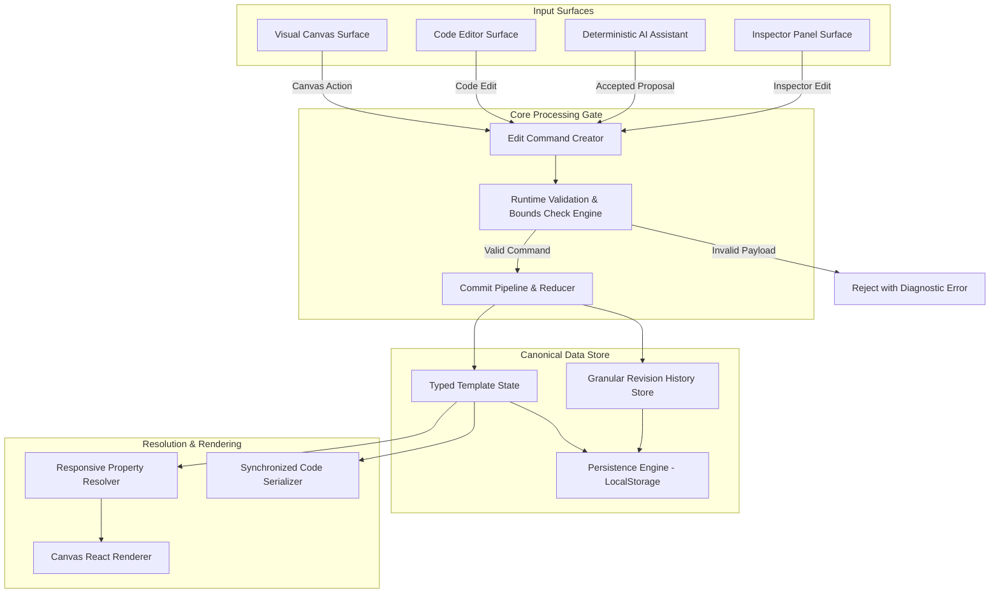

# System Design & Architecture Specification
## Project: Scoped AI Template Editor (Browser-Based Website Builder)
**Author / Role**: Senior Principal Frontend Systems Architect  
**Mode**: Technical Discussion & Architecture Document  
**Status**: Approved Architectural Blueprint  

---

## 1. Executive Summary & Problem Domain

### 1.1 Product Mission
Modern web template editors become hazardous when user or AI modifications inadvertently cause:
1. **Unscoped side-effects**: AI or code edits rewriting elements outside the user's explicit selection.
2. **Responsive regressions**: Edits intended for mobile accidentally destroying desktop/tablet layouts or vice versa.
3. **Destructive overwrites**: Lack of granular per-element/per-viewport versioning, forcing all-or-nothing undo that rolls back unrelated work.
4. **State drift**: Inconsistency between what is rendered on the visual canvas, edited in the code view, and proposed by AI.

The **Scoped AI Template Editor** solves this with a **guaranteed safe editing loop**:
- **Modular Elements with Stable IDs**: Every component is uniquely identified and addressable.
- **Unified Command & Commit Pipeline**: All modifications (Canvas, Code, AI) pass through the same validation gate and schema sanitization.
- **Explicit Viewport Scoping**: Shared base properties with explicit desktop/tablet/mobile override layers and well-defined inheritance cascades.
- **Deterministic AI Scenario Engine**: An offline, deterministic text-to-edit engine with strict selection and field boundaries.
- **Per-Element, Per-Viewport Granular Recovery**: Element-level time-travel that creates forward history entries without rolling back unrelated components.

---

## 2. Core Architectural Pillars & Design Principles



### Key Architectural Tenets:
1. **Single Canonical Source of Truth**: The template is represented as a pure, JSON-serializable, typed node tree. Canvas, Code, and Inspector are purely derived projection views.
2. **Command Pattern with Strict Invariants**: State is never mutated directly. Every change is an explicit `EditCommand` containing `source`, `targetIds`, `viewportScope`, `baseRevision`, and `typedPropertyChanges`.
3. **Inheritance & Resolution Hierarchy**:
   $$\text{Resolved Property} = \text{Override}(\text{Viewport}) \;\lor\; \text{Base Value} \;\lor\; \text{Default Token}$$
4. **Zero-Destruction Code & AI Boundary**: Invalid code edits or out-of-scope AI proposals are rejected at runtime without corrupting the canonical state.

---

## 3. Data Schema & Type System Specification

### 3.1 Core Template & Element Schema

```typescript
/**
 * Supported viewports and editing scopes
 */
export type Viewport = "desktop" | "tablet" | "mobile";
export type Scope = "all" | Viewport;

/**
 * Standard typography, color, spacing, and layout properties
 */
export interface ElementStyleProps {
  fontFamily?: string;
  fontWeight?: 300 | 400 | 500 | 600 | 700 | 800;
  fontSize?: number;          // in px
  lineHeight?: number;        // unitless or %
  letterSpacing?: number;     // in px
  textAlign?: "left" | "center" | "right" | "justify";
  color?: string;             // hex, rgb, or css variable
  backgroundColor?: string;
  marginTop?: number;         // in px
  marginBottom?: number;      // in px
  paddingTop?: number;        // in px
  paddingBottom?: number;     // in px
  width?: number | "auto" | "100%";
  height?: number | "auto";
  borderRadius?: number;      // in px
  borderWidth?: number;       // in px
  borderColor?: string;
  opacity?: number;
  display?: "flex" | "block" | "grid" | "none";
  flexDirection?: "row" | "column";
  gap?: number;
  alignItems?: "flex-start" | "center" | "flex-end" | "stretch";
  justifyContent?: "flex-start" | "center" | "flex-end" | "space-between";
}

/**
 * Responsive overrides container per element
 */
export interface ViewportOverrides {
  desktop?: Partial<ElementStyleProps>;
  tablet?: Partial<ElementStyleProps>;
  mobile?: Partial<ElementStyleProps>;
}

/**
 * Canonical Element Node
 */
export interface ElementNode {
  readonly id: string;                           // Stable identifier (e.g. "hero-heading")
  name: string;                                  // Human readable label
  kind: "section" | "container" | "text" | "button" | "image" | "link" | "input" | "card";
  icon: string;                                  // UI icon key
  content?: string;                              // Text content or image URL
  baseProps: ElementStyleProps;                  // Shared default style props across all viewports
  overrides: ViewportOverrides;                  // Viewport-specific style overrides
  children?: ElementNode[];                      // Nested hierarchy
  version: number;                               // Per-element monotonically increasing revision number
}

/**
 * Complete Canonical Template Model
 */
export interface TemplateModel {
  templateId: string;
  templateName: string;
  schemaVersion: string;                         // Semantic schema version (e.g., "1.0.0")
  revision: number;                              // Global template revision counter
  updatedAt: string;                             // ISO timestamp
  elements: ElementNode[];                       // Root level nodes
}
```

### 3.2 Command, Proposal, & History Schema

```typescript
/**
 * Origin source of an edit command
 */
export type EditSource = "canvas" | "inspector" | "code_editor" | "ai_assistant" | "history_restore";

/**
 * Edit Command Payload for the unified commit pipeline
 */
export interface EditCommand {
  commandId: string;
  source: EditSource;
  targetIds: string[];                           // Array of stable element IDs
  scope: Scope;                                  // "all" | "desktop" | "tablet" | "mobile"
  baseRevision: number;                          // Base revision against which the edit is applied
  changes: {
    content?: string;
    styleProps?: Partial<ElementStyleProps>;
    reorder?: {
      parentId: string;
      sourceIndex: number;
      targetIndex: number;
    };
  };
  metadata?: {
    prompt?: string;
    description?: string;
  };
}

/**
 * Deterministic AI Proposal Item
 */
export interface AIProposalItem {
  proposalId: string;
  elementId: string;
  elementName: string;
  scope: Scope;
  beforeContent?: string;
  afterContent?: string;
  beforeStyle?: Partial<ElementStyleProps>;
  afterStyle?: Partial<ElementStyleProps>;
  status: "pending" | "accepted" | "rejected" | "stale";
  validationError?: string;
}

/**
 * Granular Per-Element & Per-Viewport Revision History Entry
 */
export interface RevisionEntry {
  revisionId: string;
  timestamp: string;                             // ISO string
  displayTime: string;                           // "HH:MM:SS"
  kind: "manual" | "ai" | "restore";
  source: EditSource;
  elementId: string;
  elementName: string;
  scope: Scope;
  propertyKey: "content" | "style" | "structure" | "all";
  beforeState: {
    content?: string;
    props?: Partial<ElementStyleProps>;
  };
  afterState: {
    content?: string;
    props?: Partial<ElementStyleProps>;
  };
  globalRevision: number;
}
```

---

## 4. Subsystem Architectures

### 4.1 Responsive Property Resolution Engine
To guarantee that single-view edits leave other views untouched, property resolution uses a strict fallback hierarchy:

```
                  ┌───────────────────────────────┐
                  │      Active Viewport (V)      │
                  │   [Desktop / Tablet / Mobile] │
                  └───────────────┬───────────────┘
                                  │
                                  ▼
               Is there an explicit override for V?
                             /         \
                       YES  /           \  NO
                           /             \
                          ▼               ▼
                 Apply Overrides[V]   Fallback to BaseProps
                          \               /
                           \             /
                            ▼           ▼
                      Final Computed Element Style
```

```typescript
export function resolveElementProps(
  node: ElementNode,
  viewport: Viewport
): ElementStyleProps {
  const base = node.baseProps || {};
  const override = node.overrides?.[viewport] || {};
  return {
    ...base,
    ...override,
  };
}
```

### 4.2 Unified Validation & Commit Pipeline
Every edit, regardless of origin (Canvas, Inspector, Code, AI, or Restore), is processed through a strict 5-stage validation gate:

```
[Input Surface] 
       │
       ▼ (EditCommand)
┌─────────────────────────────────────────────────────────────┐
│ 1. Structural Check: Verify targetIds exist in tree         │
│ 2. Revision Check: Verify baseRevision matches (stale guard)│
│ 3. Scope Gate: Verify viewport scope is authorized          │
│ 4. Schema Sanitizer: Strip forbidden fields / invalid types │
│ 5. Tree Immutability: Produce pristine next state tree      │
└──────────────────────────────┬──────────────────────────────┘
                               │
                ┌──────────────┴──────────────┐
                ▼                             ▼
       [Success: Commit]              [Failure: Abort]
  - Update Node & Version       - Return diagnostic error
  - Append History Entry        - Keep last valid state intact
  - Increment Global Revision
```

### 4.3 Deterministic AI Demo Engine
The deterministic scenario engine uses pattern-matching heuristics, target element validation, and strict schema validation:

```typescript
export interface ScenarioRule {
  id: string;
  name: string;
  matcher: (prompt: string, nodes: ElementNode[], scope: Scope) => boolean;
  generator: (prompt: string, nodes: ElementNode[], scope: Scope) => AIProposalItem[];
}
```

#### Documented Deterministic Paths:
1. **Content Rewrite Path**:
   - Matches: `"rewrite"`, `"headline"`, `"copy"`, `"tagline"`, `"punchy"`.
   - Action: Generates high-converting marketing copy customized for the selected element's kind.
2. **Style Transformation Path**:
   - Matches: `"larger"`, `"smaller"`, `"modern font"`, `"dark background"`, `"accent color"`.
   - Action: Applies typed style property changes (e.g. `fontSize: +20%`, `borderRadius: 16`, `bg: "#1E1B4B"`).
3. **Move / Resize / Reorder Path**:
   - Matches: `"reorder"`, `"move down"`, `"full width"`, `"compact padding"`.
   - Action: Adjusts spacing margins, widths, or child order.
4. **One-Viewport Responsive Adjustment Path**:
   - Matches: `"mobile hero smaller"`, `"stack buttons on mobile"`, `"tablet padding"`.
   - Scope: Target single viewport (`mobile` or `tablet`), leaving `desktop` untouched.
5. **Multi-Element Batch Edit Path**:
   - Matches: Multiple elements selected + prompt like `"unify font and radius"`.
   - Action: Returns individual before/after proposals for each selected ID with independent accept/reject controls.
6. **Safe Failure & Stale Guard Paths**:
   - **No Selection**: Returns friendly error proposal requiring target selection.
   - **Unsupported Instruction**: Returns helpful fallback indicating supported capabilities.
   - **Stale Base Revision**: Detects if canvas was modified after proposal creation, tagging proposal as `stale` with warning badge.

### 4.4 Bidirectional Canvas-Code Synchronization
- **Code Serializer**: Converts the active `TemplateModel` or selected `ElementNode` subtree into formatted, human-readable HTML/JSX markup with data attributes `data-element-id="xyz"`.
- **Code Parser & Reconciler**: Parses updated markup, validates matching open/close tags, extracts modified content and inline style attributes, verifies that element IDs match the schema, and commits changes via `EditCommand`.
- **Safety Boundary**: If markup contains invalid syntax, unclosed tags, or removed essential IDs, the editor displays line-level diagnostic errors, and **zero** modifications reach the canonical state.

### 4.5 Granular Per-Element & Per-Viewport Recovery System
Traditional editors implement undo/redo as a global stack `past[]` and `future[]`. In our system:
- **Global Undo/Redo**: Supported for standard sequential editing.
- **Granular Independent Recovery**: The user can open the **History Drawer**, locate an element (e.g., `Hero Heading`), view all past revisions across viewports, and click **Restore Revision #3 (Mobile)**.
- **Non-Destructive Time Travel**: Restoring a revision does NOT rewind the whole page; it generates a **new forward commit** targeted solely at `hero-heading` for `mobile`, preserving all edits on other sections.

---

## 5. Technology Stack & Directory Layout

### 5.1 Tech Stack
- **Framework**: React 18+ with TypeScript (Strict Mode).
- **Build Tool**: Vite 6.x.
- **Styling**: Vanilla CSS + Tailwind CSS (configured with design system design tokens).
- **Icons**: Lucide React / Custom SVG micro-components.
- **Persistence**: Browser `LocalStorage` with schema migration fallback.
- **Testing**: Vitest + React Testing Library (for unit, scope isolation, and schema tests).

### 5.2 Target Production Directory Structure

```
c:/Users/shrut/Desktop/Frontend_AI_Assessment/project-bolt-sb1-xmioodwi/project/
├── index.html
├── package.json
├── tsconfig.json
├── vite.config.ts
├── tailwind.config.js
├── docs/
│   ├── SYSTEM_DESIGN_AND_ARCHITECTURE.md   <-- This Architecture Document
│   └── analyser.md                        <-- Codebase Analysis & Gap Audit
├── src/
│   ├── main.tsx
│   ├── App.tsx                             <-- Shell & Master State Coordinator
│   ├── index.css                           <-- Global Styles, Tokens, Utility Classes
│   ├── lib/
│   │   ├── types.ts                        <-- Strict Type Contracts & Interfaces
│   │   ├── templateData.ts                 <-- Responsive One-Page Template Model
│   │   ├── resolver.ts                     <-- Viewport Resolution Engine
│   │   ├── commitPipeline.ts               <-- EditCommand Validator & Reducer
│   │   ├── aiEngine.ts                     <-- Deterministic AI Scenario Engine
│   │   ├── codeReconciler.ts               <-- JSX/HTML Parser & Serializer
│   │   ├── historyStore.ts                 <-- Element & Viewport History Manager
│   │   └── storage.ts                      <-- LocalStorage Persistence Engine
│   ├── components/
│   │   ├── TopBar.tsx                      <-- Viewport Switcher, Global Undo/Redo, Reset
│   │   ├── LayersPanel.tsx                 <-- Tree Hierarchy, Search, Visibility Toggle
│   │   ├── Canvas.tsx                      <-- Viewport Frame, Selection Overlay, Drop Zones
│   │   ├── TemplateRenderer.tsx            <-- Recursive Dynamic Node Tree Renderer
│   │   ├── Inspector.tsx                   <-- Typography, Spacing, Responsive Overrides
│   │   ├── AssistantBar.tsx                <-- AI Prompt Bar, Scope Selector, Suggestions
│   │   ├── ProposalReview.tsx              <-- Floating Before/After Diff & Approval Card
│   │   ├── HistoryDrawer.tsx               <-- Granular Per-Element Revision History
│   │   ├── CodeEditor.tsx                  <-- Bidirectional Synced Code Surface
│   │   ├── ui.tsx                          <-- Design System Primitives
│   │   └── icons.tsx                       <-- Pixel-perfect SVG Vector Icons
│   └── __tests__/
│       ├── aiScope.test.ts                 <-- Tests: AI respects selection & fields
│       ├── responsiveResolution.test.ts    <-- Tests: Viewport override isolation
│       ├── canvasCodeSync.test.ts          <-- Tests: Bidirectional sync & error preservation
│       └── elementRecovery.test.ts         <-- Tests: Independent element time travel
```

---

## 6. Verification & Quality Assurance Plan

| Verification Area | Method | Expected Invariant |
|---|---|---|
| **AI Selection Authority** | Automated Unit Test | AI proposals only contain IDs in `selectedIds`. Out-of-bounds IDs throw validation error. |
| **Viewport Scope Isolation** | Automated Unit Test | Editing `mobile` override on an element leaves `desktop` and `tablet` computed styles unchanged. |
| **Canvas & Code Consistency** | Automated Unit Test | Code edits modify tree state; invalid code shows error and keeps last valid state untouched. |
| **Independent Recovery** | Automated Unit Test | Restoring element $A$ at $T_1$ does not modify element $B$ or element $A$'s other viewports. |
| **Responsive Shell Usability** | Browser Subagent / Manual | Editor operates seamlessly at 1280px screen width with responsive previews (1440px, 768px, 375px). |
| **State Persistence** | Refresh Simulation | Page refresh maintains custom edits, proposal history, and revision timeline from `localStorage`. |
