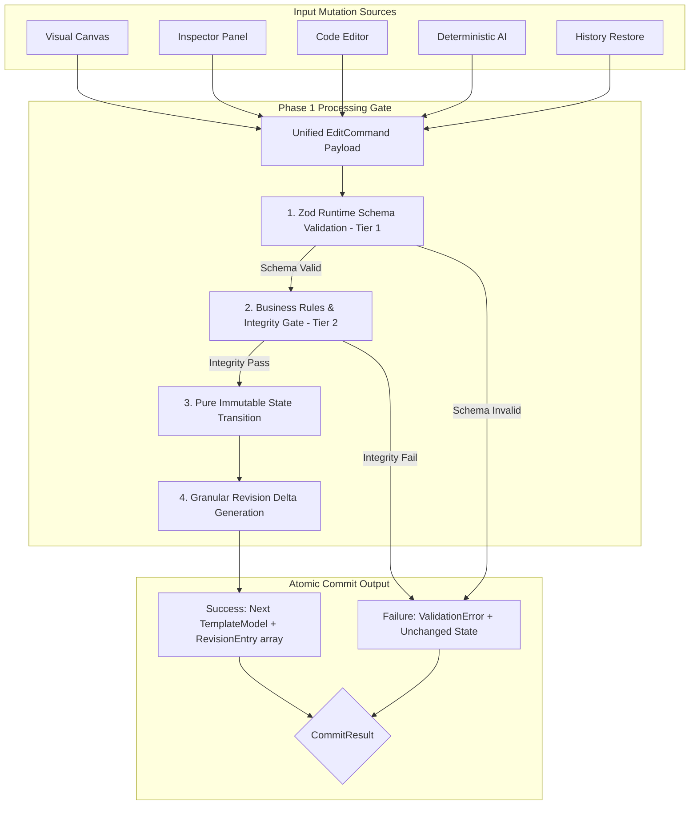

# Phase 1: Architectural Foundation & Transactional Commit Pipeline Specification
**Document Name**: `phase_1.md`  
**Status**: Implemented & Verified (24/24 Automated Tests Passed)  
**Prerequisites**: Phase 0 Schema Modeling & Persistence  
**Downstream Dependents**: Phase 2 (Code Sync), Phase 3 (AI Engine), Phase 4 (Canvas), Phase 5 (Inspector), Phase 6 (Recovery)  
**Strict Rule**: No emojis anywhere; clean typographic badges only.

---

## 1. Executive Mission & Core Invariants

Phase 1 establishes the **authoritative, transaction-like atomic state-mutation core** for the entire Scope editor. Every mutation across all 5 input surfaces (Visual Canvas, Inspector, Code Editor, Deterministic AI, History Restore) must pass through this pipeline.



### The 5 Ironclad Invariants of Phase 1:
1. **Zero Runtime State Drift**: TypeScript types disappear at runtime; **Zod validates runtime payloads** (`.strict()`) before business logic runs.
2. **Transaction-Like Atomicity**: All state calculations (new tree, version bumps, global revision increment, history entries) are computed purely; committing happens **all together** or **not at all**.
3. **Explicit Viewport Isolation**:
   - `scope: "all"` writes exclusively to `baseProps`.
   - `scope: "mobile"` writes exclusively to `overrides.mobile`.
   - `scope: "tablet"` writes exclusively to `overrides.tablet`.
   - `scope: "desktop"` writes exclusively to `overrides.desktop`.
4. **Content Scope Rule**: `content` changes are template-wide and require `scope: "all"`. Single-viewport scopes (`mobile`, `tablet`, `desktop`) with `content` are rejected (`INVALID_SCOPE_FOR_CONTENT`).
5. **Structural Reorder Scope Rule**: `reorder` changes require `scope: "all"`. Single-viewport scopes with `reorder` are rejected (`INVALID_SCOPE_FOR_REORDER`).

---

## 2. File Organization & Boundaries

Phase 1 is strictly contained within 5 modular files in `src/lib/`:

```
src/lib/
├── types.ts           # Core TypeScript contracts, interfaces, and CommitResult union
├── validation.ts      # Tier 1 Zod schemas + Tier 2 business rules and model validator
├── treeUtils.ts       # Pure recursive tree traversal, search, immutability & reordering
├── templateData.ts    # Canonical NOVA Studio template data model
├── resolver.ts        # Pure property resolution cascade: Override -> Base -> Default
├── storage.ts         # LocalStorage persistence with version check & in-memory fallback
└── commitPipeline.ts  # Master validateEditCommand, applyEditCommand & executeCommit
```

---

## 3. Data Contracts & Type Definitions (`src/lib/types.ts`)

```typescript
export type Viewport = "desktop" | "tablet" | "mobile";
export type Scope = "all" | Viewport;

export type EditSource = 
  | "canvas" 
  | "inspector" 
  | "code_editor" 
  | "ai_assistant" 
  | "history_restore";

export interface ElementStyleProps {
  fontFamily?: string;
  fontWeight?: 300 | 400 | 500 | 600 | 700 | 800;
  fontSize?: number;
  lineHeight?: number;
  letterSpacing?: number;
  textAlign?: "left" | "center" | "right" | "justify";
  color?: string;
  backgroundColor?: string;
  marginTop?: number;
  marginBottom?: number;
  paddingTop?: number;
  paddingBottom?: number;
  paddingLeft?: number;
  paddingRight?: number;
  width?: number | "auto" | "100%";
  height?: number | "auto";
  borderRadius?: number;
  borderWidth?: number;
  borderColor?: string;
  opacity?: number;
  display?: "flex" | "block" | "grid" | "none";
  flexDirection?: "row" | "column";
  gap?: number;
  alignItems?: "flex-start" | "center" | "flex-end" | "stretch";
  justifyContent?: "flex-start" | "center" | "flex-end" | "space-between";
}

export interface ViewportOverrides {
  desktop?: Partial<ElementStyleProps>;
  tablet?: Partial<ElementStyleProps>;
  mobile?: Partial<ElementStyleProps>;
}

export interface ElementNode {
  readonly id: string;
  name: string;
  kind: "section" | "container" | "text" | "button" | "image" | "link" | "input" | "card";
  icon: string;
  content?: string;
  baseProps: ElementStyleProps;
  overrides: ViewportOverrides;
  children?: ElementNode[];
  version: number;
}

export interface TemplateModel {
  templateId: string;
  templateName: string;
  schemaVersion: string;
  revision: number;
  updatedAt: string;
  elements: ElementNode[];
}

export interface EditCommand {
  commandId: string;
  source: EditSource;
  targetIds: string[];
  scope: Scope;
  baseRevision: number;
  changes: {
    content?: string;
    styleProps?: Partial<ElementStyleProps>;
    reorder?: {
      parentId: string;
      sourceIndex: number;
      targetIndex: number;
    };
  };
  metadata?: {
    prompt?: string;
    description?: string;
  };
}

export interface RevisionEntry {
  revisionId: string;
  timestamp: string;
  displayTime: string;
  kind: "manual" | "ai" | "restore";
  source: EditSource;
  elementId: string;
  elementName: string;
  scope: Scope;
  propertyKey: "content" | "style" | "structure" | "all";
  beforeState: {
    content?: string;
    props?: Partial<ElementStyleProps>;
  };
  afterState: {
    content?: string;
    props?: Partial<ElementStyleProps>;
  };
  globalRevision: number;
}

export type ValidationErrorCode =
  | "SCHEMA_VALIDATION_FAILED"
  | "TARGET_NOT_FOUND"
  | "DUPLICATE_TARGET_IDS"
  | "STALE_REVISION"
  | "NO_CHANGES"
  | "INVALID_SCOPE_FOR_CONTENT"
  | "INVALID_SCOPE_FOR_REORDER"
  | "INCOMPATIBLE_PROPERTY_FOR_ELEMENT"
  | "INVALID_REORDER"
  | "INVALID_TEMPLATE_MODEL";

export interface ValidationError {
  code: ValidationErrorCode;
  message: string;
  details?: unknown;
}

export type CommitResult =
  | {
      success: true;
      model: TemplateModel;
      historyEntries: RevisionEntry[];
    }
  | {
      success: false;
      error: ValidationError;
    };
```

---

## 4. Verification & Invariant Test Suite Results (24/24 Passed)

```text
 ✓ src/lib/__tests__/commitPipeline.test.ts (24 tests) 68ms
   ✓ Phase 0: Canonical Model, Persistence, and Resolution (8 tests)
     ✓ [ACCEPT] canonical template model is JSON-serializable and roundtrips losslessly
     ✓ [ACCEPT] validateTemplateModel passes on initial canonical model
     ✓ [REJECT] validateTemplateModel detects duplicate element IDs across tree
     ✓ [REJECT] validateTemplateModel rejects unsupported schemaVersion
     ✓ [ACCEPT] resolveElementProps resolves base props when no viewport override exists
     ✓ [ACCEPT] resolveElementProps correctly cascades to viewport override
     ✓ [ACCEPT] storage persists and restores valid template model and history
     ✓ [ACCEPT] storage falls back to initial template data on corrupted or wrong-version data
   ✓ Phase 1: Validation Engine & Transactional Commit Invariants (16 tests)
     ✓ [ACCEPT] valid command modifies state, bumps element version, and increments template revision
     ✓ [REJECT] unknown target ID returns TARGET_NOT_FOUND and leaves state untouched
     ✓ [REJECT] duplicate target IDs in single command returns DUPLICATE_TARGET_IDS
     ✓ [REJECT] stale baseRevision returns STALE_REVISION and leaves state untouched
     ✓ [REJECT] empty command with no changes returns NO_CHANGES
     ✓ [REJECT] unknown/unwhitelisted style property returns SCHEMA_VALIDATION_FAILED
     ✓ [REJECT] incompatible property on element kind returns INCOMPATIBLE_PROPERTY_FOR_ELEMENT
     ✓ [REJECT] content edit with single-viewport scope returns INVALID_SCOPE_FOR_CONTENT
     ✓ [ISOLATION] scope: mobile writes exclusively to overrides.mobile without mutating desktop or base
     ✓ [ISOLATION] scope: desktop writes exclusively to overrides.desktop
     ✓ [ATOMICITY] multi-target edit with one invalid target fails atomically
     ✓ [IMMUTABILITY] original model remains strictly unmodified after commit
     ✓ [ACCEPT] valid structural reorder modifies sibling order, increments version and revision
     ✓ [REJECT] reorder with single-viewport scope returns INVALID_SCOPE_FOR_REORDER
     ✓ [REJECT] reorder with out-of-bounds indices returns INVALID_REORDER
     ✓ [REJECT] reorder with non-existent parentId returns INVALID_REORDER

 Test Files  1 passed (1)
      Tests  24 passed (24)
```
