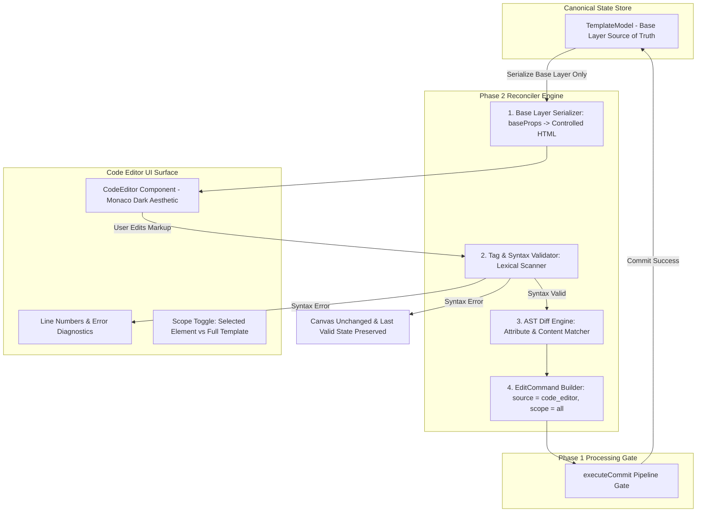

# Phase 2: Bidirectional Code Synchronization Surface & Reconciler Specification
**Document Name**: `phase_2.md`  
**Status**: Approved Reconciler Architecture Blueprint  
**Prerequisites**: Phase 0 (Data Models) & Phase 1 (Transactional Commit Pipeline)  
**Downstream Dependents**: Phase 4 (Canvas Interactive Sync), Phase 5 (Inspector Live Sync)  
**Strict Rule**: No emojis anywhere; clean typographic badges only.

---

## 1. Executive Mission & Architectural Invariants

Phase 2 builds the **bidirectional code editing surface and reconciliation engine**. It allows developers and non-technical business owners to inspect, edit, and modify the website via a controlled HTML markup representation while maintaining **100% state synchronization** with the visual canvas and **zero-destruction safety**.



### The 5 Ironclad Invariants of Phase 2:
1. **Controlled HTML Subset (No Arbitrary JS/JSX Execution)**:
   - The code editor operates exclusively on a clean, structured HTML markup subset (e.g. `<main>`, `<section>`, `<div>`, `<h1>`, `<p>`, `<button>`, `<a>`, ``).
   - Dynamic JavaScript expressions (`{fn()}`, `{cond && ...}`, `.map()`) are strictly disallowed and rejected at the lexical scanner stage.
2. **Base Layer Serialization & Scope Isolation**:
   - The serializer serializes **canonical base properties (`baseProps`)**, never resolved viewport calculations.
   - Code edits apply strictly with `scope: "all"`, modifying `baseProps` and `content` without corrupting or leaking into viewport-specific overrides.
3. **Context-Aware Scoping with Full-Template Toggle**:
   - **Default Mode**: Scoped to the currently selected component (e.g. `<h1 id="hero-heading">...</h1>`), reducing cognitive load and preventing accidental edits to other sections.
   - **Full-Template Mode**: Explicit toggle allowing developers to edit the entire page structure `<main id="nova-studio-landing">...`.
4. **Zero-Destruction Syntax Boundary**:
   - If the user writes broken HTML (unmatched tags, unclosed brackets, stripped essential IDs), the code editor displays line diagnostics and **zero modifications reach the canonical template model**.
5. **Phase 1 Commit Authority**:
   - The code reconciler never directly mutates the tree. It translates parsed markup diffs into a typed `EditCommand` with `source: "code_editor"` and delegates to `executeCommit(model, command)`.

---

## 2. File Organization & Boundaries

Phase 2 introduces 2 core modules in `src/lib/` and upgrades `src/components/CodeEditor.tsx`:

```
src/
├── lib/
│   ├── codeReconciler.ts          # Pure base-layer serializer, tag validator, and markup diff engine
│   └── __tests__/
│       └── codeReconciler.test.ts # Automated test suite for serialization, parsing, and error guards
└── components/
    └── CodeEditor.tsx             # Monaco-style dark surface, line gutter, error diagnostics, and scope toggle
```

---

## 3. Serializer Specification (`templateToMarkup`)

The serializer converts an `ElementNode` or the entire `TemplateModel` into formatted HTML markup representing the canonical base layer.

### 3.1 Tag Mapping Contract
| `ElementKind` | HTML Tag Rendered | Data / ID Attribute |
|---|---|---|
| `section` | `<section ...>` | `id="section-id"` |
| `container` | `<div ...>` | `id="container-id"` |
| `text` (Heading) | `<h1>`, `<h2>`, `<h3>` or `<p>` (based on node id/tag) | `id="text-id"` |
| `text` (Paragraph) | `<p ...>` | `id="desc-id"` |
| `button` | `<button ...>` | `id="button-id"` |
| `link` | `<a href="#" ...>` | `id="link-id"` |
| `image` | `` (self-closing) | `id="image-id"` |
| `card` | `<div class="card" ...>` | `id="card-id"` |

### 3.2 Formatting Rules:
- **Indentation**: 2 spaces per nested level.
- **Attributes**: Style properties rendered as inline `style="..."` (e.g. `style="font-size: 56px; font-weight: 700; color: #18181B; margin-bottom: 24px;"`).
- **Self-Closing Tags**: Void elements (``, `<input>`) close with `/>`.
- **Text Content**: Placed directly inside container tags with proper escaping.
- **Strict Base Layer**: Serializes only properties defined in `node.baseProps`.

### 3.3 Example Serialized Output (Selected Component: `hero-heading`):
```html
<h1 id="hero-heading" style="font-size: 56px; font-weight: 700; color: #18181B; margin-bottom: 24px;">
  Designing digital experiences that move businesses forward.
</h1>
```

### 3.4 Example Serialized Output (Full Template Mode):
```html
<main id="nova-studio-landing">
  <section id="nav">
    <span id="logo">NOVA</span>
    <div id="nav-links">
      <a id="nav-1" href="#">Work</a>
      <a id="nav-2" href="#">Services</a>
      <a id="nav-3" href="#">About</a>
      <a id="nav-4" href="#">Contact</a>
    </div>
  </section>
  <section id="hero">
    <span id="hero-eyebrow">DIGITAL PRODUCT STUDIO</span>
    <h1 id="hero-heading">Designing digital experiences that move businesses forward.</h1>
    <p id="hero-desc">We partner with ambitious teams to design, build, and ship products that feel effortless to use.</p>
    <div id="hero-cta">
      <button id="hero-btn-1">Start a project</button>
      <button id="hero-btn-2">View our work</button>
    </div>
    
  </section>
</main>
```

---

## 4. Parser, Validator & Reconciler Specification (`markupToCommands`)

The reconciler executes in 4 strictly decoupled stages:

```
Raw Code String
      │
      ▼
┌─────────────────────────────────────────────────────────────┐
│ STAGE 1: Lexical Tag Scanner & Controlled HTML Validation    │
│ - Check matching open and close tags (<tag> ... </tag>)     │
│ - Validate self-closing tags ()                  │
│ - Reject arbitrary JavaScript expressions ({...})           │
│ - Check bracket balance and quote closure                   │
└──────────────────────────────┬──────────────────────────────┘
                               │
                ┌──────────────┴──────────────┐
                ▼ [Syntax Error]              ▼ [Syntax Valid]
       Return Diagnostic              STAGE 2: AST Tree Construction
       (Canvas Untouched)             - Extract tags, IDs, content, styles
                                                      │
                                                      ▼
                                      STAGE 3: Diff Engine vs Canonical Model
                                      - Match by stable element ID
                                      - Compare against baseProps & content
                                                      │
                                                      ▼
                                      STAGE 4: EditCommand Construction
                                      - Return typed EditCommand (scope: "all")
                                                      │
                                                      ▼
                                      Phase 1 executeCommit Pipeline
```

### 4.1 Stage 1: Syntax & Tag Balance Rules
The parser tokenizes tags and tracks an open-tag stack:
1. Encountering `<tag id="..." ...>` pushes `{ tag, line }` to stack.
2. Encountering `<tag ... />` (self-closing) is consumed without pushing to stack.
3. Encountering `</tag>` pops top of stack. If top tag does not match closing tag:
   - **Error**: `Tag mismatch: Expected closing tag </${expected}> but found </${actual}> at line ${lineNumber}.`
4. Rejecting Dynamic JS: Any occurrences of `{...}` outside string quotes triggers:
   - **Error**: `Dynamic JavaScript expressions are not supported. Code editor supports standard HTML markup only.`
5. If stack is non-empty at EOF:
   - **Error**: `Unclosed tag <${tag}> opened at line ${line}.`

### 4.2 Stage 2: Element ID Extraction & Integrity
1. Every editable component in markup must have an `id="..."` attribute.
2. If an element tag has no `id`, or the `id` does not exist in the canonical `TemplateModel`:
   - **Error**: `Unknown or missing element ID on tag <${tag}> at line ${line}. Element IDs must not be removed.`

### 4.3 Stage 3: Style Attribute Parsing
Inline `style="..."` attributes are parsed into typed `ElementStyleProps`:
- `font-size: 48px` $\to$ `fontSize: 48`
- `font-weight: 700` $\to$ `fontWeight: 700`
- `color: #18181B` $\to$ `color: "#18181B"`
- `background-color: #FFFFFF` $\to$ `backgroundColor: "#FFFFFF"`
- `border-radius: 12px` $\to$ `borderRadius: 12`
- `margin-bottom: 32px` $\to$ `marginBottom: 32`
- `display: flex` $\to$ `display: "flex"`
- `flex-direction: column` $\to$ `flexDirection: "column"`

### 4.4 Stage 4: Diff Calculation & Command Generation
For each parsed element matching a canonical node:
- Computes content delta: `parsed.content !== node.content ? parsed.content : undefined`.
- Computes style delta: compares parsed style keys against `node.baseProps`.
- If differences exist, produces an `EditCommand`:
```typescript
const command: EditCommand = {
  commandId: `cmd_code_${Date.now()}`,
  source: "code_editor",
  targetIds: changedTargetIds,
  scope: "all",
  baseRevision: model.revision,
  changes: {
    content: changedContent,
    styleProps: changedStyleProps,
  },
  metadata: {
    description: "Code editor markup reconciliation",
  },
};
```

---

## 5. UI/UX Specification for Code Editor Surface (`CodeEditor.tsx`)

### 5.1 Visual Layout & Design Tokens (Monaco Dark Aesthetic)
- **Background Surface**: `#18181B` (Dark charcoal, high contrast)
- **Gutter / Line Numbers**: `#27272A` with `#71717A` monospace line numbers
- **Text Area Font**: `SF Mono`, `Geist Mono`, `ui-monospace`, `Menlo`, `monospace` (`13px`, `line-height: 1.65`)
- **Syntax Highlighting Palette**:
  - Tags (`<section`, `<h1>`): `#60A5FA` (Soft Blue)
  - Attributes (`id=`, `style=`): `#93C5FD` (Light Cyan)
  - Attribute Values (`"hero-heading"`): `#FCD34D` (Warm Amber)
  - Text Content: `#F4F4F5` (Crisp Off-White)

### 5.2 Header Toolbar:
- **Title**: `CODE`
- **Breadcrumb**: `Current Element: Hero Heading` (or `Full Template`)
- **Scope Toggle**: `[ Selected Component | Full Template ]`
- **Validation Status**:
  - Valid: `[Valid Markup]` (Subtle green badge: `#1B7F4B`)
  - Invalid: `[Invalid Code]` (Subtle red badge: `#C0392B`)
- **Close Button**: `<IconClose />` (`Escape`)

### 5.3 Footer Action Bar:
- **Diagnostic Message**:
  - When valid: `Valid markup. Press Apply Changes to commit.`
  - When invalid: `Line 4: Unmatched tag <h1> closed with </section>. Last valid version preserved.`
- **Actions**:
  - `Cancel` button: Discards uncommitted code changes and closes modal.
  - `Apply Changes` button (`⌘↵`): Enabled only when markup is syntactically valid and non-empty.

---

## 6. Edge Case & Failure Mode Matrix

| Edge Case | Reconciler Behavior | Canvas & State Impact |
|---|---|---|
| **Mismatched Closing Tag** (`<div><h1></div>`) | Parser returns `SYNTAX_ERROR` with line number. Status bar displays error badge. | State remains 100% untouched. Last valid canvas state preserved. |
| **Dynamic JS Expression** (`{items.map(...)}`) | Parser returns `SYNTAX_ERROR: Dynamic JavaScript expressions not supported`. | State remains 100% untouched. |
| **Missing / Deleted ID** (`<h1>New Text</h1>`) | Parser returns `TARGET_NOT_FOUND` indicating missing ID. | State remains 100% untouched. |
| **Unknown ID** (`<h1 id="ghost-id">...</h1>`) | Reconciler checks canonical tree, returns `TARGET_NOT_FOUND`. | State remains 100% untouched. |
| **Invalid Style Value** (`style="font-size: 9999px;"`) | Zod bounds validation in commit pipeline returns `SCHEMA_VALIDATION_FAILED`. | State remains 100% untouched. |
| **No Modifications Made** | Reconciler detects zero diffs, returns `NO_CHANGES`. | State remains 100% untouched. |
| **Stale Revision Conflict** | If canvas was edited while code editor was open, base revision mismatch returns `STALE_REVISION`. | Displays stale warning prompt to reload live markup. |

---

## 7. Automated Test Matrix for Phase 2 (`codeReconciler.test.ts`)

```typescript
describe("Phase 2: Code Reconciler & Bidirectional Sync", () => {
  // Serializer Tests
  it("[ACCEPT] serializes single selected element to formatted HTML markup (baseProps only)");
  it("[ACCEPT] serializes full template model with nested indentation and self-closing tags");
  it("[ACCEPT] does not serialize resolved viewport overrides into base markup");

  // Parser & Syntax Validator Tests
  it("[ACCEPT] parses valid markup and extracts tags, IDs, content, and inline styles");
  it("[REJECT] rejects mismatched closing tags with line diagnostic");
  it("[REJECT] rejects unclosed open tags at EOF");
  it("[REJECT] rejects markup where element id attribute has been stripped");
  it("[REJECT] rejects dynamic JavaScript expressions ({...})");

  // Reconciler & Commit Integration Tests
  it("[ACCEPT] reconciles text content edit on selected component and commits through pipeline (scope: all)");
  it("[ACCEPT] reconciles style attribute edit (fontSize, color) and commits through pipeline");
  it("[ACCEPT] reconciles multiple edits in full template mode atomically");
  it("[REJECT] returns NO_CHANGES when applied code is identical to canonical state");
  it("[REJECT] returns TARGET_NOT_FOUND if user introduces non-existent element ID");
  it("[IMMUTABILITY] syntax errors leave canonical template model strictly unmodified");
});
```

---

*This document serves as the exact specification for executing Phase 2.*
