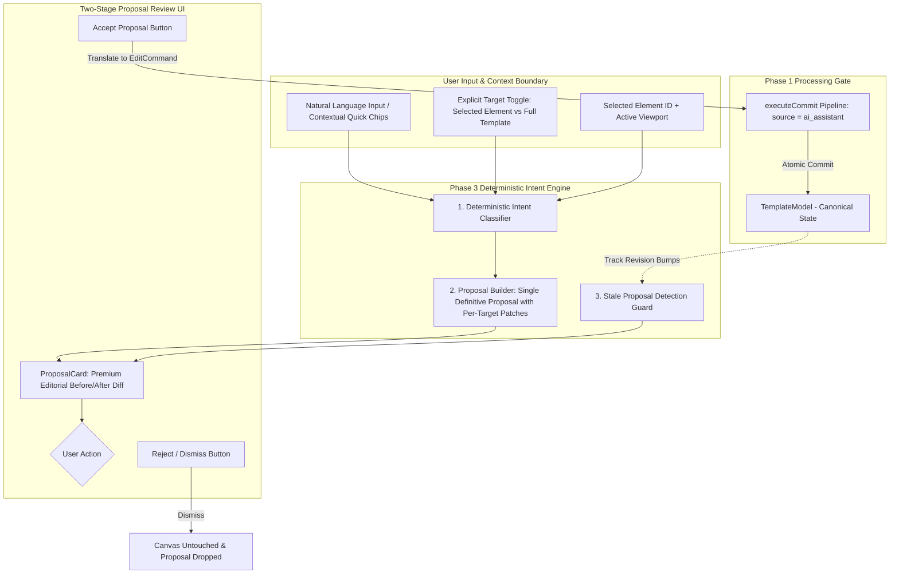

# Phase 3: Deterministic AI Assistant & Proposal Pipeline Specification
**Document Name**: `phase_3.md`  
**Status**: Approved & Locked Architecture Specification  
**Prerequisites**: Phase 0 (Data Models), Phase 1 (Transactional Commit Pipeline), Phase 2 (Code Reconciler)  
**Downstream Dependents**: Phase 4 (Canvas Interactive Integration), Phase 5 (Inspector Integration)  
**Strict Rule**: No emojis anywhere; clean typographic badges only.

---

## 1. Executive Mission & Architectural Invariants

Phase 3 builds the **deterministic AI assistant and two-stage proposal engine**. It enables users to apply copy enhancements, visual hierarchy adjustments, theme shifts, responsive mobile layouts, and multi-element transformations with **zero hallucination, zero third-party API dependencies, and 100% predictable, testable output**.



### The 6 Ironclad Invariants of Phase 3:
1. **Single Definitive Deterministic Proposal**:
   - The engine generates exactly **one** deterministic proposal per request. No variation sprawl, no random output.
2. **Strict Selection Authority (`NO_SELECTION` Guard)**:
   - In "Selected Element" mode, an element **must** be selected. If no element is selected, the engine rejects with `NO_SELECTION` and the input UI is disabled. The AI never invents or guesses a target automatically.
3. **Explicit Target Scope Boundary**:
   - The user explicitly chooses `[ Selected Element | Full Template ]`. Natural language instructions cannot silently expand the target boundary.
4. **Scope Routing Contract**:
   - `content` changes strictly require `scope: "all"`.
   - `style` / `layout` changes use active viewport scope (e.g. `scope: "mobile"` writes to `overrides.mobile`).
   - `reorder` changes strictly require `scope: "all"`.
5. **Diff Card Preview Only (Zero Ghost Canvas Mutation)**:
   - The canonical canvas remains 100% untouched while a proposal is pending. The proposal is previewed solely within `ProposalCard.tsx` using refined, neutral editorial styling.
6. **Stale Proposal Detection Guard**:
   - Every proposal captures `baseRevision: model.revision`. If the canvas is modified before the user clicks Accept, the proposal is flagged as `[STALE]`, and Phase 1 rejects stale commits (`STALE_REVISION`).

---

## 2. File Organization & Boundaries

Phase 3 is contained within 3 modular files in `src/lib/` and `src/components/`:

```
src/
├── lib/
│   ├── aiEngine.ts               # Pure deterministic intent matcher, transform generators, and proposal builder
│   └── __tests__/
│       └── aiEngine.test.ts      # Automated test suite for all 6 scenarios, stale guards, and commit integration
└── components/
    ├── AiAssistant.tsx           # Command bar / drawer with context pills, quick chips, and proposal queue
    └── ProposalCard.tsx          # Side-by-side before/after visual diff card with Accept/Reject actions
```

---

## 3. The 6 Deterministic AI Scenarios & Transformation Contracts

### Scenario 1: Copywriting & Tone Transformation
Operates on text/heading/button elements with `scope: "all"`:
- **"Make it punchier / concise"**:
  - `hero-heading` $\to$ `"Digital products built to lead."`
  - `hero-desc` $\to$ `"We design and ship high-impact digital experiences for ambitious brands."`
  - `hero-btn-1` $\to$ `"Get Started"`
- **"More enterprise / B2B corporate"**:
  - `hero-heading` $\to$ `"Enterprise-grade digital experience engineering."`
  - `hero-desc` $\to$ `"Partnering with global organizations to design scalable digital systems and platforms."`
- **"Minimal / creative studio"**:
  - `hero-heading` $\to$ `"Form. Function. Digital craft."`
  - `hero-desc` $\to$ `"An independent design and development studio shaping modern digital products."`

### Scenario 2: Visual Hierarchy & Typography Scaling
Operates on typography styles:
- **"Increase visual hierarchy / Bolder heading"**:
  - Heading: `fontSize: 64`, `fontWeight: 800`, `letterSpacing: -1`, `lineHeight: 1.1`
- **"More minimal and refined"**:
  - Heading: `fontSize: 48`, `fontWeight: 600`, `letterSpacing: 0.5`, `lineHeight: 1.2`
  - Paragraph: `fontSize: 16`, `lineHeight: 1.6`, `color: "#71717A"`

### Scenario 3: Color Palette & Theme Shifting
Applies harmonious palettes across selected sections or the full template:
- **"Dark luxury theme"**:
  - Section `backgroundColor: "#09090B"`, text `color: "#F4F4F5"`, button `backgroundColor: "#FAFAFA"`, `color: "#09090B"`
- **"Warm editorial theme"**:
  - Section `backgroundColor: "#FAF9F6"`, text `color: "#18181B"`, button `backgroundColor: "#18181B"`, `color: "#FFFFFF"`
- **"Vibrant studio accent"**:
  - Button `backgroundColor: "#3D5AFE"`, `color: "#FFFFFF"`, eyebrow `color: "#3D5AFE"`

### Scenario 4: Responsive Mobile Layout Adjustments (Viewport-Scoped AI)
When active viewport is **Mobile** (`mobile`):
- **"Optimize hero for mobile"**:
  - `overrides.mobile`: `fontSize: 32`, `paddingTop: 32`, `paddingBottom: 32`, `gap: 16`
- **"Stack CTA buttons vertically"**:
  - `hero-cta` `overrides.mobile`: `flexDirection: "column"`, `gap: 12`, `width: "100%"`
  - `hero-btn-1` & `hero-btn-2` `overrides.mobile`: `width: "100%"`

### Scenario 5: Multi-Element Synchronized Transformations
Performs synchronized updates across multiple related targets atomically using per-target patches:
- **"Polish all CTA buttons"**:
  - Targets: `hero-btn-1`, `hero-btn-2`, `nav-4`
  - Patches: `borderRadius: 8`, `fontWeight: 600`, `paddingTop: 12`, `paddingBottom: 12`
- **"Align hero content center"**:
  - Targets: `hero-eyebrow`, `hero-heading`, `hero-desc`, `hero-cta`
  - Patches: `textAlign: "center"`, `alignItems: "center"`, `justifyContent: "center"`

### Scenario 6: Structural Reordering via AI
- **"Move services above about"**:
  - Formalized reorder contract: `{ parentId: "nova-studio-landing", sourceIndex: 2, targetIndex: 1 }`
  - Shows clear before vs after sibling order in diff card.

---

## 4. Context-Aware Quick Action Chips

| Context | Active Viewport | Rendered Quick Chips |
|---|---|---|
| Heading (`hero-heading`) | Desktop | `[Punchier Copy]`, `[Bolder Hierarchy]`, `[Enterprise B2B]`, `[Minimal Studio]` |
| Paragraph (`hero-desc`) | Desktop | `[Concise Copy]`, `[Enterprise Tone]`, `[Refine Spacing]` |
| CTA Button (`hero-btn-1`) | Desktop | `[Stronger CTA]`, `[Rounded Button]`, `[Accent Color]` |
| Container (`hero-cta`) | Mobile | `[Stack Buttons]`, `[Full Width]`, `[Compact Spacing]` |
| Section (`hero`) | Desktop | `[Dark Luxury]`, `[Warm Editorial]`, `[Center Align]` |
| Full Template | Desktop / Mobile | `[Dark Luxury Theme]`, `[Warm Editorial Theme]`, `[Optimize for Mobile]` |

---

## 5. Proposal Model & Lifecycle

```typescript
export interface ProposalDiff {
  elementId: string;
  elementName: string;
  beforeContent?: string;
  afterContent?: string;
  beforeProps?: Partial<ElementStyleProps>;
  afterProps?: Partial<ElementStyleProps>;
  beforeStructure?: string[];
  afterStructure?: string[];
}

export interface AiProposal {
  readonly id: string;
  readonly commandId: string;
  readonly baseRevision: number;
  readonly targetIds: string[];
  readonly scope: Scope;
  readonly prompt: string;
  readonly description: string;
  readonly status: "pending" | "accepted" | "rejected";
  readonly diffs: ProposalDiff[];
  readonly command: EditCommand;
}
```

---

## 6. UI/UX Specification for AI Assistant (`AiAssistant.tsx` & `ProposalCard.tsx`)

### 6.1 Layout & Aesthetics
- **Surface**: High-contrast dark charcoal (`#18181B` / `#27272A`), zero purple/neon gradients, clean monospace badges.
- **Header**:
  - Title: `ASSISTANT` with `<IconSparkles />`.
  - Target Mode Toggle: `[ Selected Element | Full Template ]`.
  - Context Pill: `[Target: Hero Heading]` + `[Viewport: Desktop]`.
- **Input Bar**:
  - Placeholder: `"Describe an edit (e.g. Make it punchier, Dark luxury, Stack buttons)..."`
  - Disabled state when `mode === "selected"` and `selectedNode === null`.
  - Submit Button (`⌘↵`): Active only when prompt is non-empty and valid target exists.
- **Proposal Card (`ProposalCard.tsx`)**:
  - Header: Prompt description + Scope badge (`[Scope: All]` / `[Scope: Mobile]`).
  - Stale Alert: Amber badge `[STALE - Canvas modified since proposal was generated]` when revision has changed.
  - Side-by-Side Diff Table:
    - **Before**: `#27272A` neutral charcoal surface.
    - **After**: `#1E293B` subtle slate accent surface with fine typography highlights.
  - Actions: `Reject` (`Escape`) and `Accept Proposal` (`⌘↵`).

---

## 7. Automated Test Matrix for Phase 3 (`aiEngine.test.ts`)

```typescript
describe("Phase 3: Deterministic AI Assistant & Proposal Engine", () => {
  // Guard Tests
  it("[REJECT] returns NO_SELECTION when target mode is selected but selectedNode is null");
  it("[REJECT] rejects prompt when target element does not exist");
  it("[REJECT] rejects proposal targeting unselected element in Selected mode");

  // Intent & Matching Tests
  it("[ACCEPT] generates punchy copywriting proposal for selected heading");
  it("[ACCEPT] generates corporate B2B copywriting proposal for selected paragraph");
  it("[ACCEPT] generates visual hierarchy typography proposal (fontSize, fontWeight)");
  it("[ACCEPT] generates dark luxury color theme proposal in Full Template mode");

  // Viewport Scoping Tests
  it("[ACCEPT] generates mobile-isolated layout proposal (overrides.mobile only) when mobile viewport active");
  it("[ACCEPT] generates multi-element synchronized proposal for all CTA buttons using patches");
  it("[ACCEPT] generates structural reorder proposal with before/after sibling ordering");

  // Stale Guard & Pipeline Integration Tests
  it("[STALE] detects proposal as stale when model revision changes before acceptance");
  it("[ACCEPT] committing accepted proposal increments model revision and logs AI history delta");
  it("[IMMUTABILITY] rejecting proposal leaves template model strictly unmodified");
});
```
